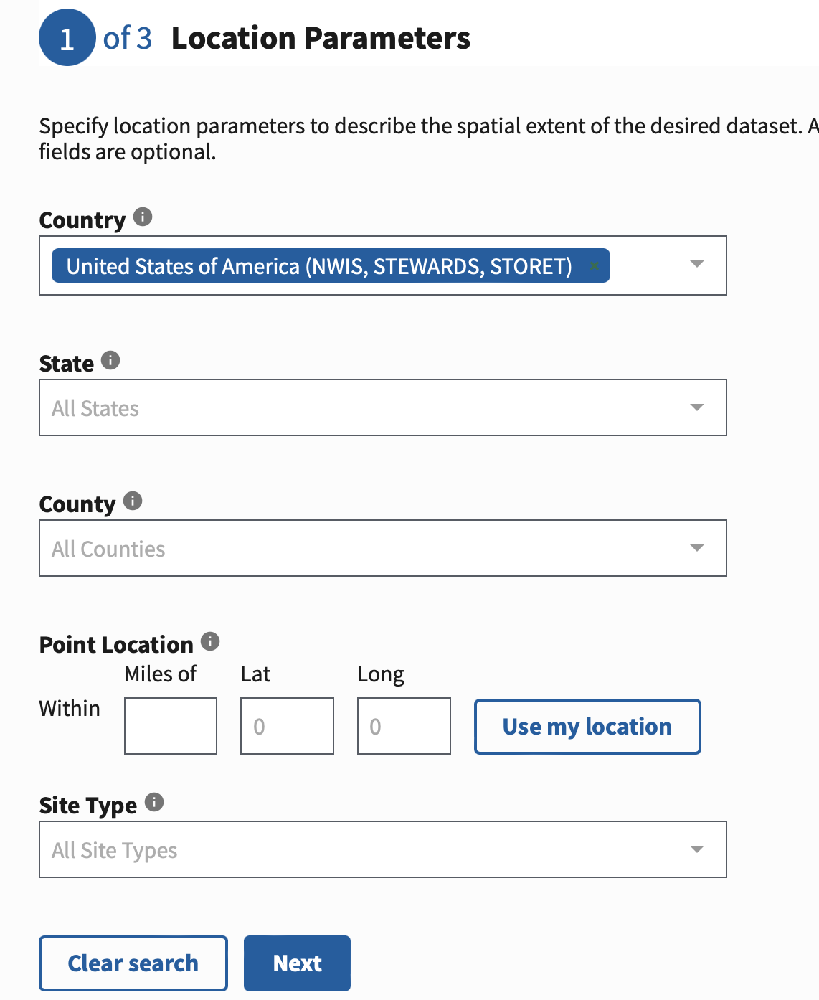
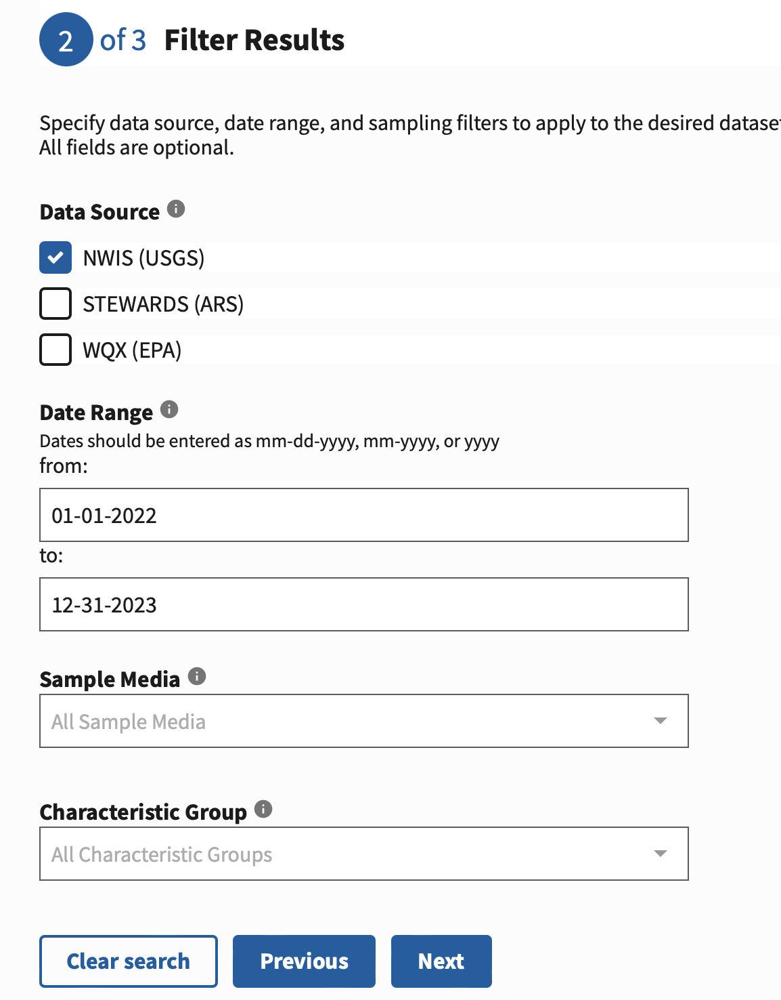
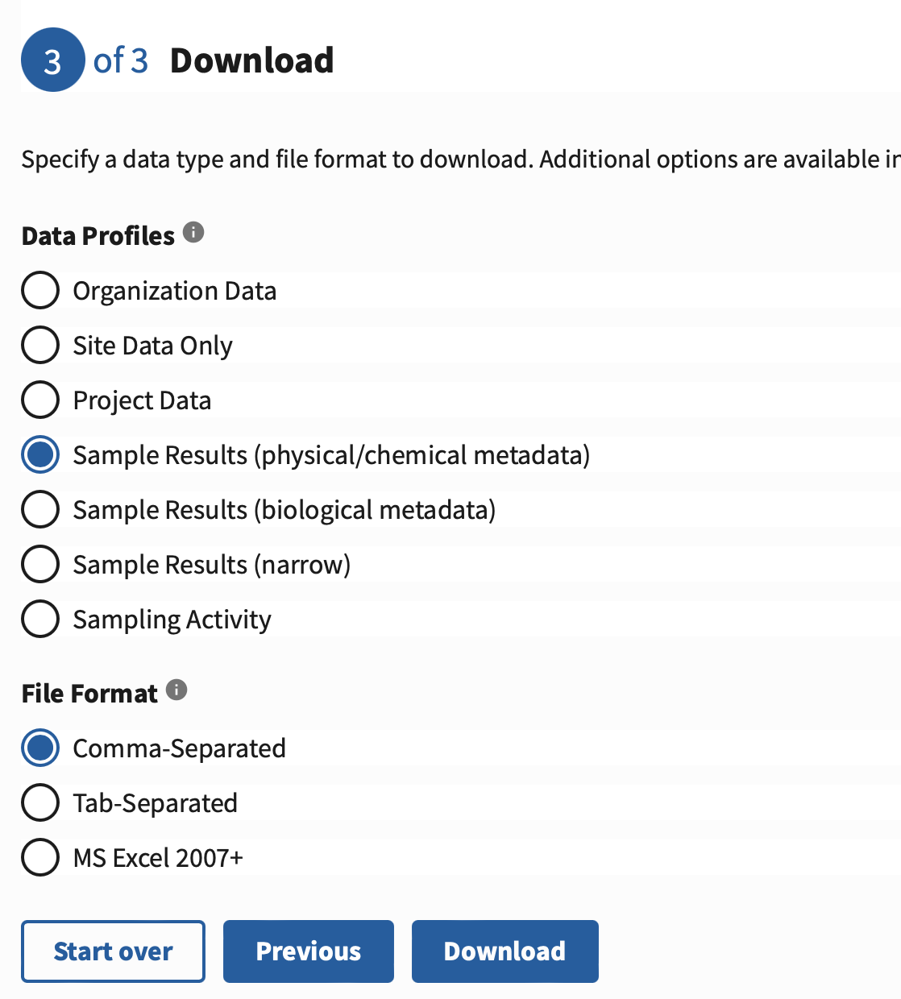

# DS410_final_project

## Steps for obtaining raw dataset used in cluster mode
### DOWNLOAD DATASET HERE:
https://drive.google.com/file/d/1BUWjYVQseIe5vuLmv6aS4KzvVRezGODQ/view?usp=drive_link

*File size exceeded GitHub's limits, unable to store on our repository*

### OR DOWNLOAD WITH THIS LINK TO: [Water quality portal](https://www.waterqualitydata.us/#countrycode=US&mimeType=csv&sorted=no&providers=NWIS&providers=STEWARDS&providers=STORET)
**Disclaimer:**
Downloading through the water quality portal is tedious and tends to fail halfway through unless you break up the time ranges you wish to download. It will be less tedious if you download from four different time ranges instead of doing the 2 year span all at once. We created an R script called **DS410_Dataset.Rmd** to integrate these four different CSVs into one in order to obtain one singular raw dataset for our cluster mode. Also, there is one column name that contained a backslash that needed to be renamed, this R script does that for you as well.

Below are the example time ranges you should download from if you want to use the R script.

df1 <- read.csv("~/Downloads/resultphyschem_01-06_22.csv")

df2 <- read.csv("~/Downloads/resultphyschem_06-01_22.csv")

df3 <- read.csv("~/Downloads/resultphyschem_01-06_23.csv")

df4 <- read.csv("~/Downloads/resultphyschem_06-12_23.csv")

## How to run: 
FINAL_DS410_Project_Cluster.py is the primary code for this project. It uses our final selected method of replacing NULL values with the average of each characteristic for its state. In other words, if we had a missing value of conductance from a sample in State College, we would replace it with the average for State College.

Alternative_DS410_Project_Mean_Method_1.py is a secondary code that shows the implementation of replacing NULL values with the average of each characterstic across the entire dataset. 

